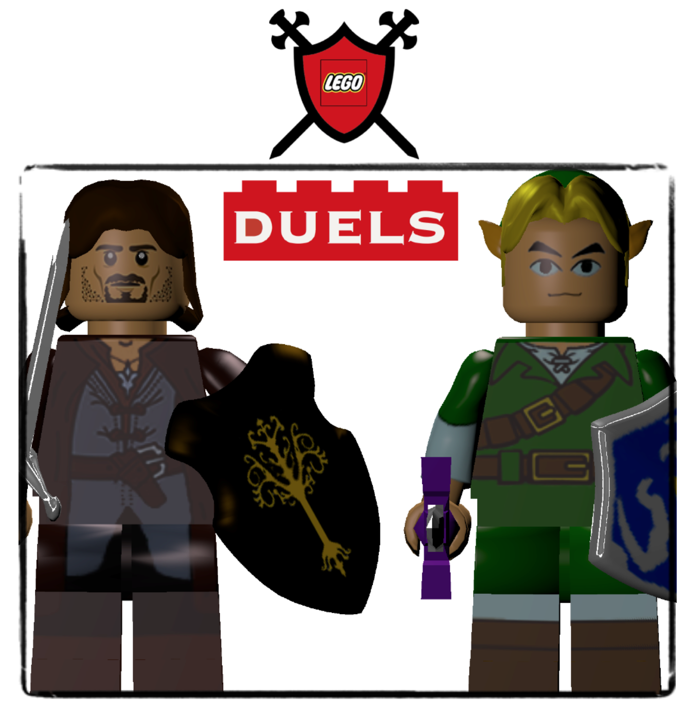
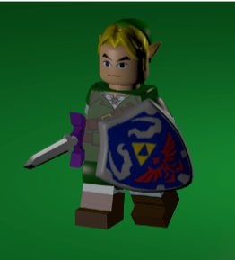
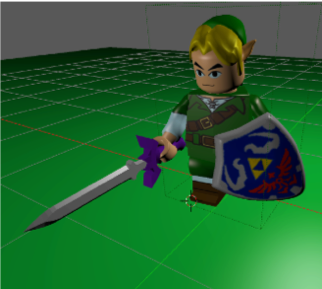
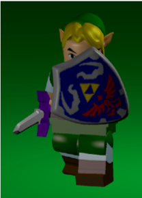
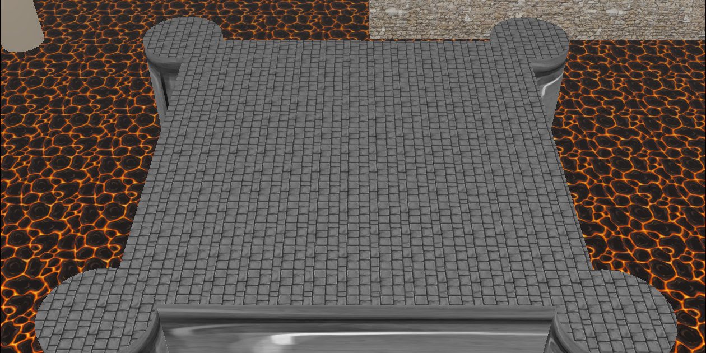
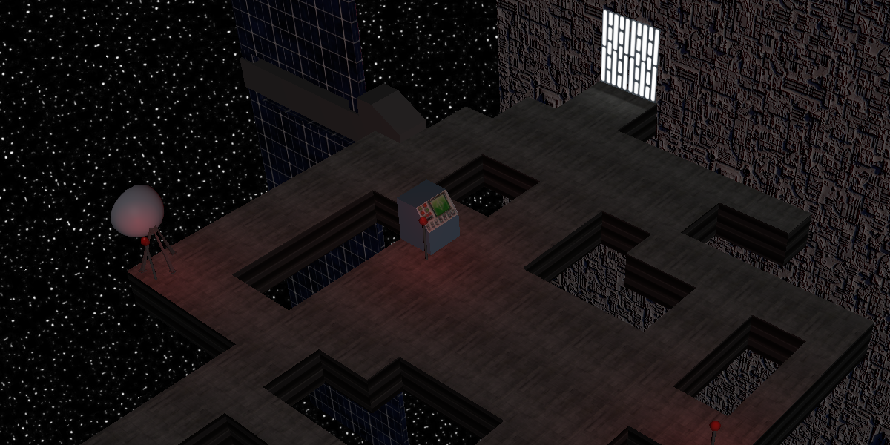
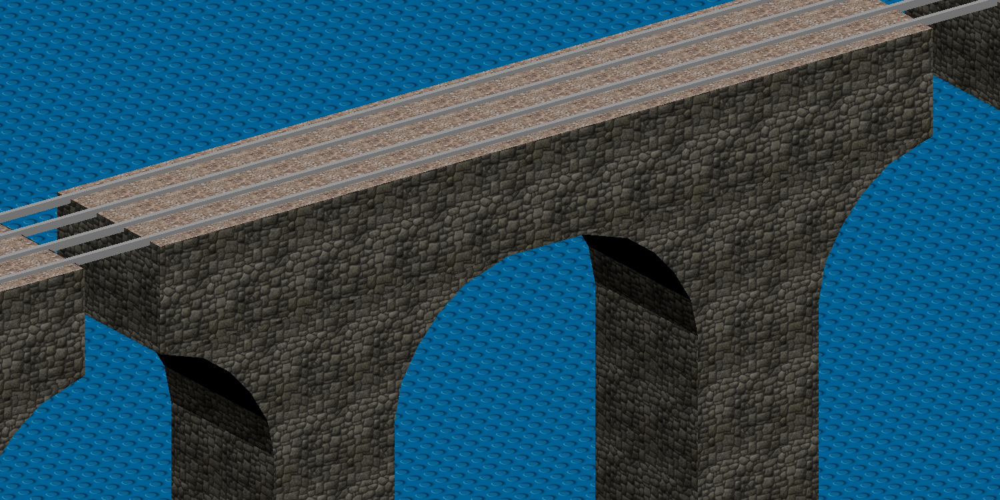

# LEGO-Duels

  

Juego de peleas con espadas desarrollado con Blender.

## Movimientos

Ejemplos de la animación de caminar, atacar y defender.

## Escenarios

  
  
  

## Acknowledgement

Juego creado por Diego Alcoceba Álvarez, Melissa Palestino Infante, Pablo Rodríguez Pérez y Adrián Santamaría Martín para la asignatura de “Síntesis y Animación de Imágenes” en la Universidad Politécnica de Madrid durante el curso 2016-2017.
